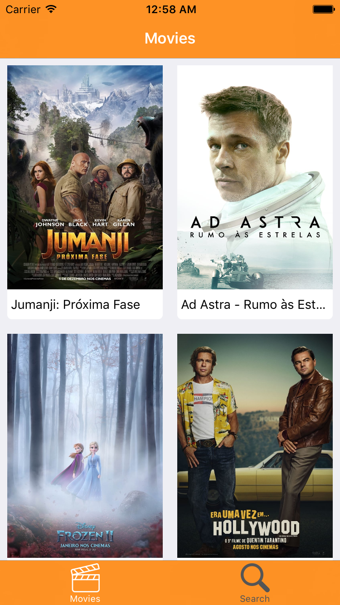
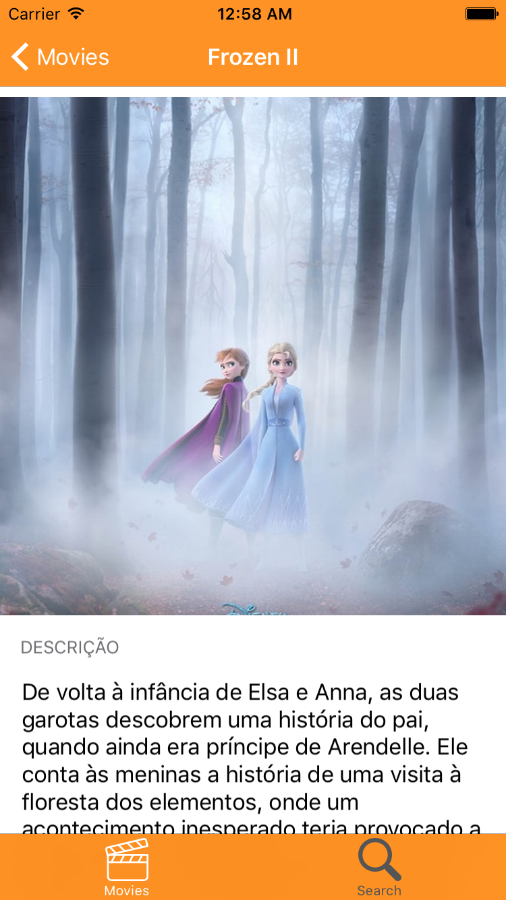
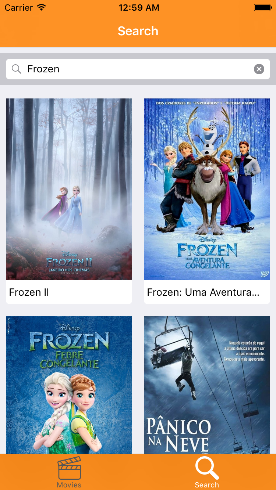

# Recrutamento iOS

Aplicaçãao de biblioteca de livros feita com iOS Nativo

## Requisitos
- Swift 5
- Target: iOS 10.3.1
- SwiftLins instalado pelo HomeBrew

## Funcionalidades

- Lista de filmes populares
- Detales de livros
- Visualizar Recomendações de livros
- Pesquisar livros

## Design

As telas que queremos que você desenvolva é uma simples lista de filmes. Você precisará mostrar 2 filmes por linha, exibindo a imagem e o nome do filme. Ao clicar em um filme, você  será redirecionado para uma nova tela, onde você poderá ver a foto do filme, junto com sua descrição.

## Padrões do projeto

### Arquitetura 
- MVVM - C com closures 

### Desenvolvimento da UI
- ViewCode

### Boas práticas
- SwiftLint

### Padão da Camada de Rede
- Repository Pattern
