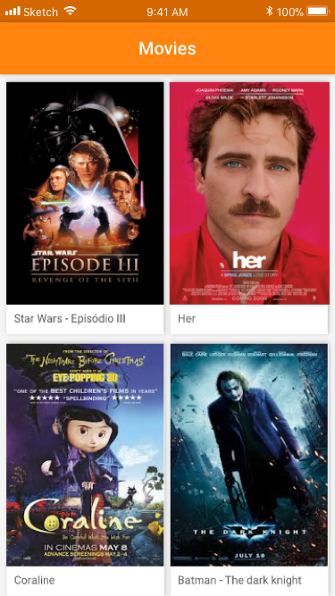

# Recrutamento iOS

Fazer parte da Cubos significa enfrentar constantes desafios de programação. Por conta da natureza volátil do projeto (muitas coisas mudam muito rápido!), é crítico que nós da equipe de iOS sejamos capazes de desenvolver funcionalidades flexíveis, pensando no longo prazo. Gostamos muito de alterar nossas telas para ver como nossos usuários reagem, mas se todas essas mudanças fossem hardcoded, certamente teríamos um grande problema! :stuck_out_tongue:

Por conta disso, muitas das coisas que você vê em diversas aplicações da Cubos (incluindo aspectos visuais como cores e imagens) são controladas pelo nosso servidor. Como essa habilidade em desenvolver funcionalidades flexíveis é muito importante para nós, queremos ver como você se saíria se fosse encarregado de criar uma lista de filmes, e seu respectivo detalhes!

## Lista De Filmes

A lista de filmes é um exemplo muito bom de uma aplicação que você encontrará no seu dia a dia na Cubos. Todos os dados dos filmes são carregados através de um JSON recebido do servidor. Assim, toda vez que adicionarmos, removermos ou editarmos um filme, essa informação fica disponível para o usuário quase que instantaniamente.

## Design

As telas que queremos que você desenvolva é uma simples lista de filmes. Você precisará mostrar 2 filmes por linha, exibindo a imagem e o nome do filme. Ao clicar em um filme, você  será redirecionado para uma nova tela, onde você poderá ver a foto do filme, junto com sua descrição.




## Endpoints

Para popular sua tela é necessário utilizar a api do The Movie Database:
Para isso é preciso criar uma conta grátis para poder ter acesso a uma chave da API:
https://www.themoviedb.org/documentation/api?language=pt-BR

Depois você pode consumir o seguinte endpoint para pegar uma lista de filmes mais populares:
https://developers.themoviedb.org/3/movies/get-popular-movies

Nesse endpoint você pode utilizar as seguiontes propriedades para montar a listagem de filmes e a tela de detalhes:
```
poster_path
overview
title
```

Existe paginação nessa chamada, mas não é necessário realizar, sendo considerado um bônus.

Sinta-se livre para explorar a api e incrementar o app se assim desejar :)

## Requisitos

Queremos conhecer você como professional, e por isso não vamos estabelecer restrições de padrões de código/arquitetura e afins. Siga seu coração e realize a tarefa da forma que achar melhor - é justamente o que queremos ver!
As únicas coisas que precisamos que você siga são:
- Usar Swift 4.2 ou maior
- Target: iOS 10.0


## Submissão

Faça um fork desse repositório, e quando tudo estiver pronto, é só abrir um pull request!
Como alternativa caso você não queira que seu código seja público, você pode também criar um repositório privado chamado `ios-recruitment` e mandar um e-mail para `douglas.barbosa@cubos.io` (mailto:douglas.barbosa@cubos.io) para continuarmos o processo.

## Contato

Nós esperamos que esse `README` resolva todas as suas dúvidas, mas caso você tenha qualquer outra dúvida, fique à vontade para entrar em contato conosco através do e-mail  `douglas.barbosa@cubos.io` (mailto:douglas.barbosa@cubos.io). Pedimos apenas que as dúvidas sejam relacionadas ao exercício, para que possamos dar toda a atenção necessária a todos os candidatos.
